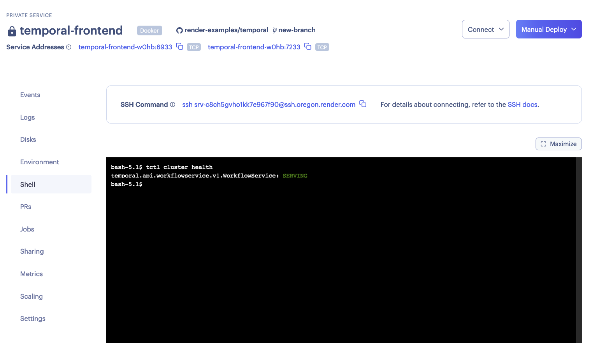
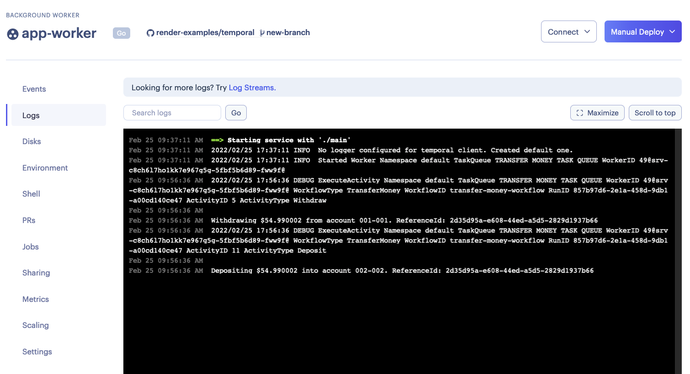

# Temporal 

This is a template for running a Temporal cluster on Render. It includes an example Go app that interacts with the cluster. Fork this repo and then click the button below to try it out!

[](https://render.com/deploy)

This repo defines a [Render Blueprint](https://render.com/docs/blueprint-spec) with the following components:
- Temporal cluster:
  - Two Postgres databases, `temporal-db` and `temporal-db-visibility`.
  - A `temporal-all` server that runs all Temporal services.
  - `temporal-ui` provides the Temporal web UI.
- Example app (based on Temporal's [Go SDK Example](https://github.com/temporalio/money-transfer-project-template-go)):
  - `app-workflow-trigger` runs a simple HTTP server with two routes:
    - `/` for health checking.
    - `/trigger-workflow` for kicking off the `TransferMoney` workflow.
  - `app-worker` executes any triggered workflows.

For a more production-ready setup, use the Blueprint defined in [render.with_scaling.yaml](render.with_scaling.yaml) rather than the one in [render.yaml](render.yaml). In this Blueprint, each of the four Temporal services are run as its own Render service that can be scaled independently.It also comes with an ElasticSearch instance configured. In your fork, run
```bash
$ mv render.with_scaling.yaml render.yaml
```
and commit the change. You may also wish to tweak the autoscaling parameters, which are currently defined as:
```yaml
scaling:
  minInstances: 2
  maxInstances: 3
  targetMemoryPercent: 80
  targetCPUPercent: 80
```
# Steps

1. Click the "Deploy to Render" button.
2. In your Render dashboard, click on the service `app-workflow-trigger`, and copy its URL. Let's say it's `https://app-workflow-trigger.onrender.com/`.
3. To verify that your Temporal cluster is running correctly, you can use Temporal's CLI tool `tctl`. There are two ways to access `tctl` provided on the `temporal-all` (`temporal-frontend` if you're using `render.with_scaling.yaml`) service:
    - Using [SSH](https://render.com/docs/ssh).
    - Using the web shell:
      
    
   Some commands to run (with expected, non-exact output):
    ```bash
    $ tctl cluster health
    temporal.api.workflowservice.v1.WorkflowService: SERVING
    $ tctl admin membership list_gossip  # list all temporal services.
    [
      {
        "role": "frontend",
        "member_count": 1,
        "members": [
          {
            "identity": "10.129.8.40:10000"
          }
        ]
      },
      {
        "role": "history",
        "member_count": 1,
        "members": [
          {
            "identity": "10.129.8.40:7234"
          }
        ]
      },
      {
        "role": "matching",
        "member_count": 1,
        "members": [
          {
            "identity": "10.129.8.40:7235"
          }
        ]
      },
      {
        "role": "worker",
        "member_count": 1,
        "members": [
          {
            "identity": "10.129.8.40:7239"
          }
        ]
      }
    ]
    ```
4. Go to `https://app-workflow-trigger.onrender.com/`. If everything is well, you will see "OK!".
5. Now trigger the example workflow by visiting `https://app-workflow-trigger.onrender.com/trigger-workflow`. It should print
    ```
    Transfer of $54.990002 from account 001-001 to account 002-002 is processing. ReferenceID: 5e1f48db-5021-4e05-adb6-8bca54587d40

    WorkflowID: transfer-money-workflow RunID: 3179d644-4235-4ea8-b1a4-b7c4fabb0afd
    ```
6. `app-worker` will immediately pick up and run this workflow. You can verify by clicking on the service, and going to the "Logs" tab:

7. To check that the workflow has been run successfully, click on the `temporal-web` service, and go to its URL. Under the `default` namespace, you should find your workflow's run with the status "Completed".


# Disclaimer

[auto-setup-override.sh](temporal-cluster/server/auto-setup/auto-setup-override.sh) is based on Temporal's [auto-setup.sh script](https://github.com/temporalio/temporal/blob/077d39c775/docker/auto-setup.sh), with some modifications made to better accommodate Render's architecture.
